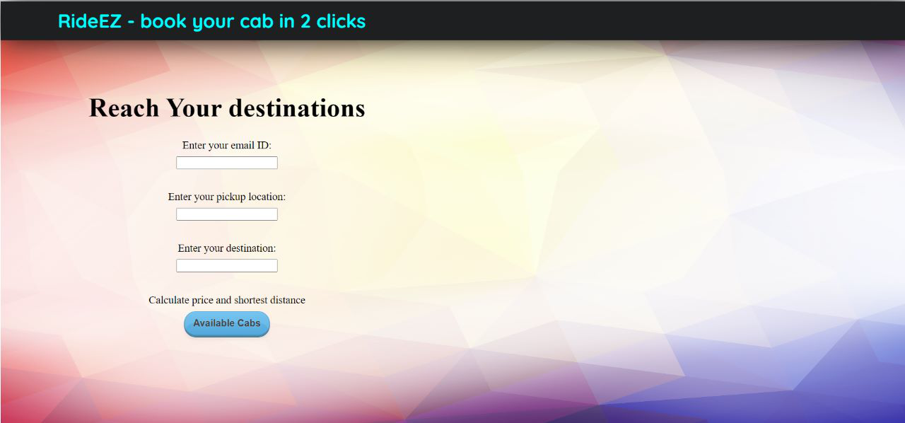
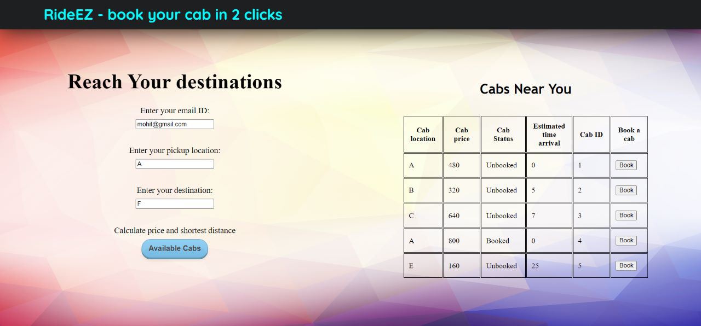
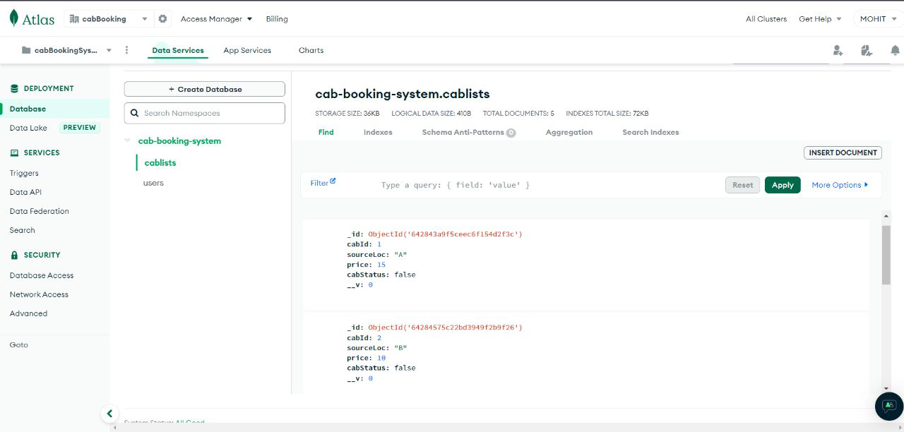

# CAB BOOKING SYSTEM

The CAB BOOKING SYSTEM is a web application that enables users to book cabs online. It provides users with features such as estimated arrival time, minimum price, minimum time, price list of different cabs, and status of cabs whether they are booked or unbooked.

To calculate the minimum time between two nodes, the system uses Dijkstra's algorithm, a popular algorithm used in graph theory to determine the shortest path between two nodes in a graph. This algorithm helps in finding the most efficient route for the cabs and reduces the time taken for the cab to reach the destination.

Overall, the CAB BOOKING SYSTEM provides a convenient and efficient way for users to book cabs online and helps them save time and money by providing them with accurate estimates of arrival time, minimum price, and minimum time required to reach their destination.

## Getting Started

Repository link - https://github.com/MohitRana2001/cab-booking-system.

Pull this repository on your system.

Download the required dependencies on your system.

Run these command to install required dependencies:
    ``` npm i  ```

Fire up the server using the below script and open the index.html simultaneously  

SCRIPT:    ``` npm start ``` 
(run this script in backend directory)
(it will run the command nodemon app.js)


### HOW TO USE

After running the above commands successfuly on your system perform these instructions.

1.Enter email ID

2.Enter source destination

3.Enter final destination

4.Then you press the available cabs button.

5.Now you will be able to see a table with following columns:

    CAB PRICE

    ESTIMATED TIME ARRIVAL

    CAB ID

    STATUS OF CAB

    BOOK button

    SOURCE LOCATION

6.Now you can choose between these cabs according to your requirements and enjoy your journey.

7.Bonus Point: You can change the prices, source destination and booked status of cabs from mongoDB database.

## TECHNOLOGIES USED

HTML

CSS

VANILLA JS

NODEJS

MONGOOSE

EXPRESSJS

MONGODB

## SCREENSHOTS






